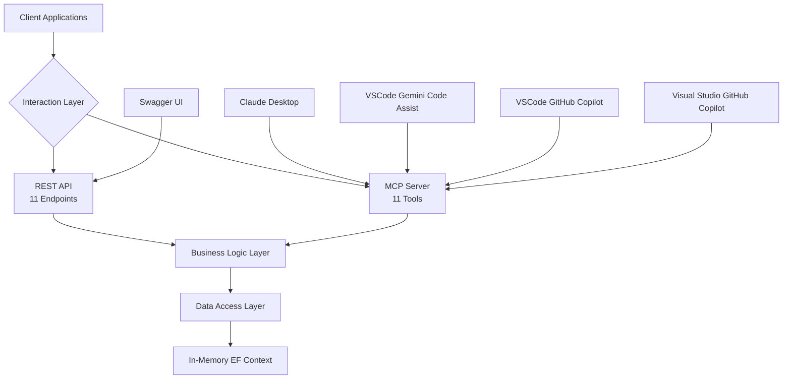
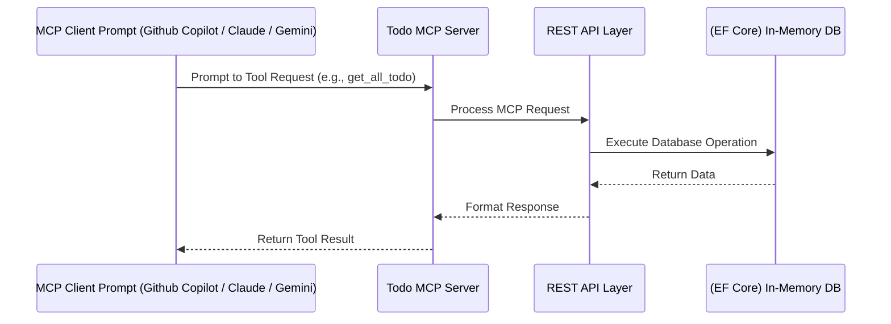
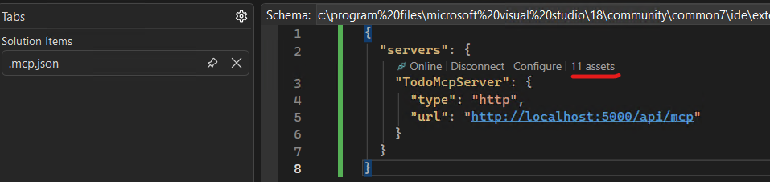
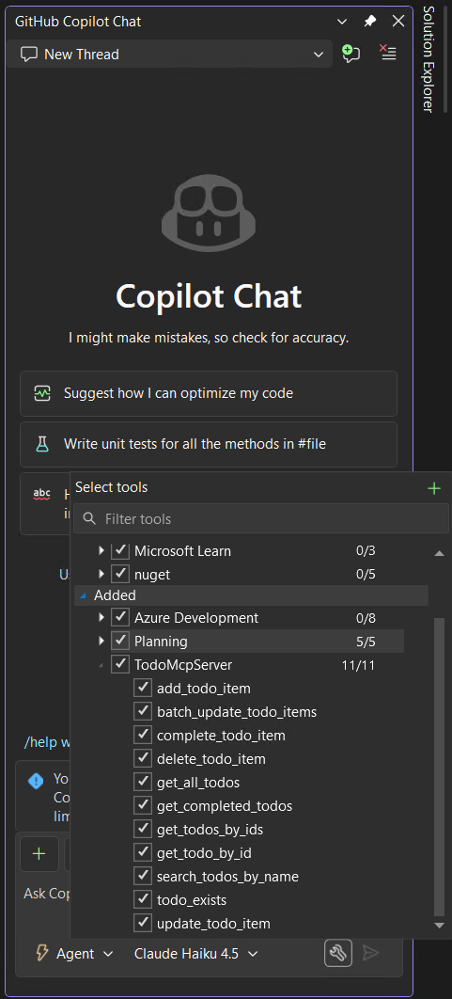
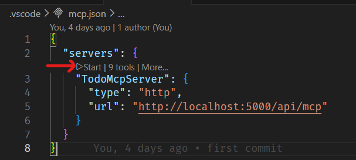
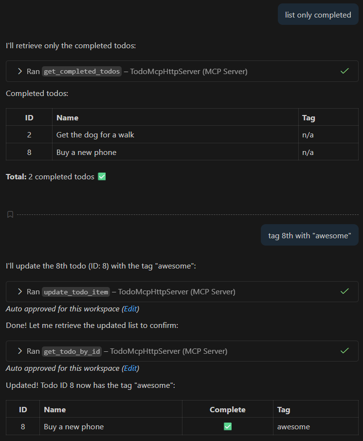
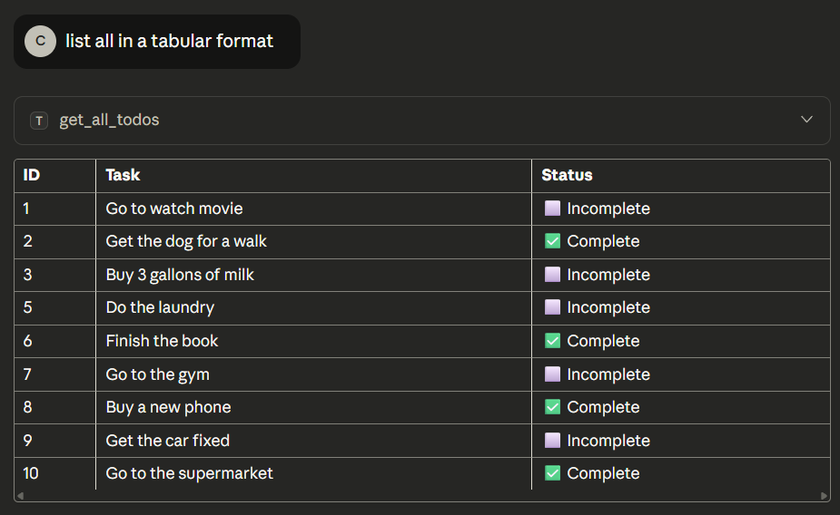
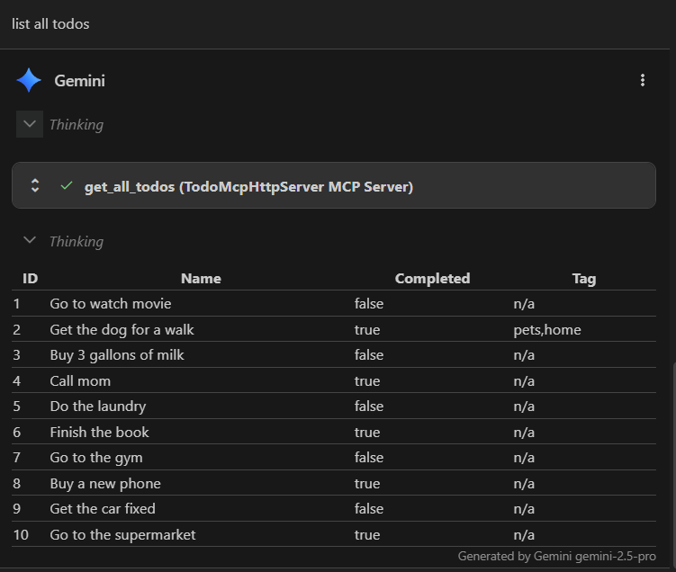
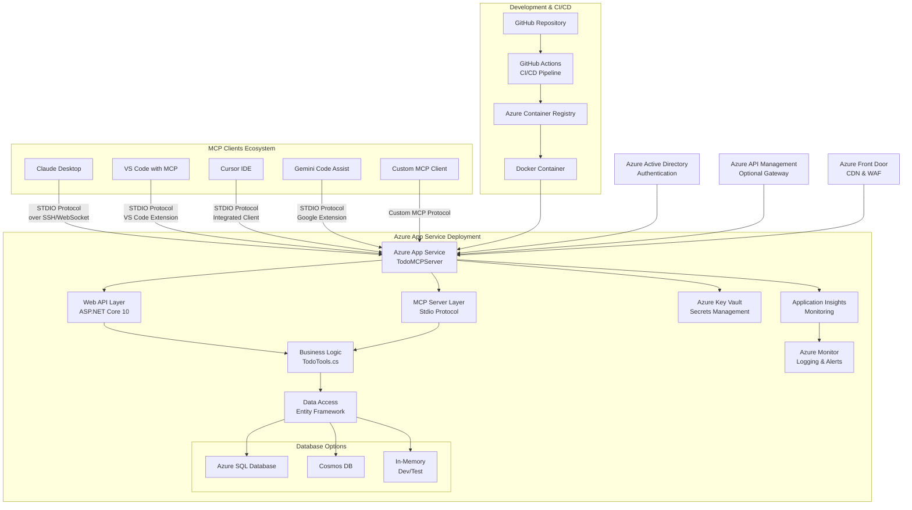
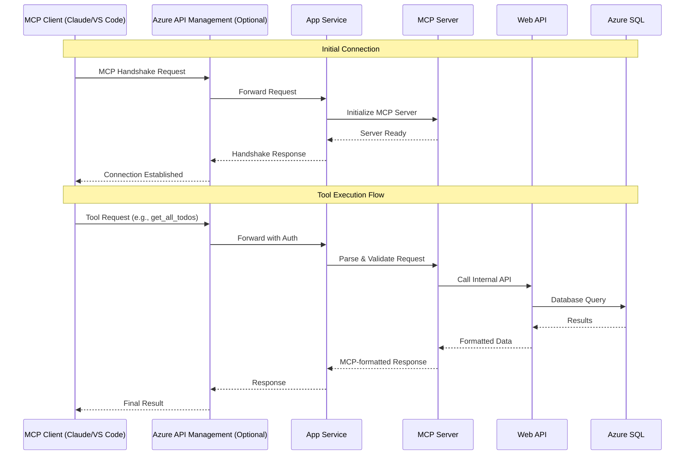

<!--
Prompt:

I have a github project at location: https://github.com/cpateldev/TodoMCPServer

This project uses Asp.net minimal web api targeting .Net 10 and addes MCP server support to todo minimal web api. It has total 11 REST endpoints and 11 MCP tools configured. The project has also mcp server settings files for VSCode, Gemini Code assist fro VSCode and Claude Desktop config to test MCP server tools to access Todo via web api.
The project is configured to use Todo db in memory EF context and has open api with Swagger UI support.

I want to generate detailed documentation for this project.
Section:

Overview
Features
Imgshields.io badges for .Net 10
PreRequisites
Nuget Package dependencies
How to run application
Web API REST endpoint details and how to call them via CURL, SwaggerUI
MCP Tools details
MCP json config files and its usage overview

Instructions:
- Use code and config files to generate documents. Do not add documentation for anything outside code and config files
- Use tabular format when applicable.
- Provide details of important code excerpts.
- Generate mermaid diagram for important flows if applicable
]: #
-->

# Todo MCP Server (.NET Minimal API with MCP server support)

## Table of contents

- [Todo MCP Server (.NET Minimal API with MCP server support)](#todo-mcp-server-net-minimal-api-with-mcp-server-support)
  - [Table of contents](#table-of-contents)
  - [Overview](#overview)
  - [Architecture Diagram](#architecture-diagram)
  - [Features](#features)
  - [Tools and MCP Clients](#tools-and-mcp-clients)
  - [Prerequisites](#prerequisites)
  - [Create a New Project named `TodoMCPServer`](#create-a-new-project-named-todomcpserver)
    - [Add Required NuGet Packages](#add-required-nuget-packages)
    - [Update `Program.cs` to Configure MCP Server](#update-programcs-to-configure-mcp-server)
    - [Map REST Endpoints and add MCP Tools](#map-rest-endpoints-and-add-mcp-tools)
  - [How to Run the Application](#how-to-run-the-application)
    - [1. Clone and Navigate if you want to just try it out existing project](#1-clone-and-navigate-if-you-want-to-just-try-it-out-existing-project)
    - [2. Restore Dependencies](#2-restore-dependencies)
    - [3. Run the Application](#3-run-the-application)
    - [4. Access Interfaces](#4-access-interfaces)
    - [5. Alternative Launch Methods](#5-alternative-launch-methods)
  - [Package Dependencies](#package-dependencies)
  - [Web API REST Endpoints](#web-api-rest-endpoints)
    - [Endpoint Details Table](#endpoint-details-table)
    - [Swagger UI Usage](#swagger-ui-usage)
  - [MCP Tools Details](#mcp-tools-details)
    - [MCP Tools Table](#mcp-tools-table)
    - [Prompt to Request Flow](#prompt-to-request-flow)
  - [MCP JSON Config Files and Usage](#mcp-json-config-files-and-usage)
    - [Visual Studio Github Copilot Configuration](#visual-studio-github-copilot-configuration)
      - [Visual Studio MCP support](#visual-studio-mcp-support)
    - [VS Code GitHub Copilot Configuration](#vs-code-github-copilot-configuration)
    - [GitHub Copilot responses to Todo MCP](#github-copilot-responses-to-todo-mcp)
    - [Claude Desktop Configuration](#claude-desktop-configuration)
    - [Claude Desktop response to Todo MCP](#claude-desktop-response-to-todo-mcp)
    - [Gemini Code Assist Configuration](#gemini-code-assist-configuration)
    - [Gemini Code Assists responses to Todo MCP](#gemini-code-assists-responses-to-todo-mcp)
    - [Configuration Comparison](#configuration-comparison)
    - [Testing MCP Tools](#testing-mcp-tools)
    - [Testing using MCP Inspector](#testing-using-mcp-inspector)
  - [Deploy to Azure App Service](#deploy-to-azure-app-service)
    - [Option A: Using Azure CLI](#option-a-using-azure-cli)
    - [Option B: Using Visual Studio](#option-b-using-visual-studio)
  - [Test Todo REST API in Azure](#test-todo-rest-api-in-azure)
  - [Secure Your Endpoint (Optional)](#secure-your-endpoint-optional)
  - [Monitor \& Scale](#monitor--scale)
  - [End to end flow diagram](#end-to-end-flow-diagram)
  - [Client communication flow](#client-communication-flow)
  - [Project Structure](#project-structure)
  - [Troubleshooting MCP Connections](#troubleshooting-mcp-connections)
  - [Security Notes](#security-notes)
  - [References](#references)

## Overview

TodoMCPServer is a modern .NET 10 application that combines a traditional REST API with **Model Context Protocol (MCP)** server capabilities for todo list management. The project serves as both a standard web API and an MCP-enabled service that can be integrated with AI assistants like Claude Desktop, Gemini Code Assist, and other MCP-compatible tools.

TodoMCPServer is a comprehensive implementation that combines a Todo web API with Model Context Protocol (MCP) server support. This project demonstrates how traditional REST APIs can be extended with AI agent tooling capabilities through MCP, allowing AI assistants to interact with your application directly.

## Architecture Diagram

> requires mermaid extension in VS Code



## Features

- **Dual Interface**: Both REST API (11 endpoints) and MCP server (11 tools)
- **Modern Stack**: .NET 10 with Minimal API architecture
- **Database**: Entity Framework Core with In-Memory DB provider
- **API Documentation**: OpenAPI/Swagger UI integration
- **MCP Server Support**: MCP Server support using both HTTP and STDIO transport types
- **MCP Integration**: Pre-configured with Claude Desktop, Gemini Code Assist, Visual Studio Github Copilot, and VSCode MCP Client for major AI development tools
- ** MCP Inspector Support**: Easily test MCP tools using MCP Inspector using HTTP or STDIO transport types
- **Cross-Platform**: Runs on any platform supporting .NET 10

## Tools and MCP Clients

[](https://dotnet.microsoft.com/en-us/download/dotnet/10.0)
[](https://learn.microsoft.com/en-us/ef/core/)
[](https://dotnet.microsoft.com/en-us/apps/aspnet)
[](https://swagger.io/specification/)
[](https://swagger.io/tools/swagger-ui/)
[](https://modelcontextprotocol.io/)

[](https://claude.ai/)
[](https://visualstudio.microsoft.com/)
[](https://code.visualstudio.com/)
[](https://developers.google.com/gemini)

## Prerequisites

- **.NET 10 SDK** or later
- **Visual Studio 2025+** or **VS Code** with C# Dev Kit
- **Git** for version control
- For MCP testing: **GitHub Copilot in VS Code**, **Claude Desktop**, **Gemini Code Assist**, or any MCP-compatible client

## Create a New Project named `TodoMCPServer`

```bash
dotnet new webapi -n TodoMCPServer
cd TodoMCPServer
```
### Add Required NuGet Packages

```bash
dotnet add package Microsoft.AspNetCore.Diagnostics.EntityFrameworkCore --version 10.0.0
dotnet add package Microsoft.AspNetCore.OpenApi --version 10.0.0
dotnet add package Microsoft.EntityFrameworkCore.InMemory --version 10.0.0
dotnet add package ModelContextProtocol --version 0.4.1-preview.1
dotnet add package ModelContextProtocol.AspNetCore --version 0.4.1-preview.1
dotnet add package Swashbuckle.AspNetCore.SwaggerUI --version 10.0.1
```
### Update `Program.cs` to Configure MCP Server

```csharp
builder.Services
    .AddMcpServer()
    .WithStdioServerTransport()   // Use stdio transport for local AI clients
    .WithHttpTransport()          // Use HTTP transport for web-based clients
    .WithToolsFromAssembly();     // Automatically register all MCP tools in the assembly
```
> [!WARNING]
> NOTE: .WithStdioServerTransport() is commented out to allow deployment to Azure App Service as stdio transport is not supported there.

### Map REST Endpoints and add MCP Tools

Create a new class `Tools\TodoService.cs` and implement the MCP tools for todo operations. Each tool corresponds to a REST API endpoint.

```csharp
using ModelContextProtocol.AspNetCore.Tools;
using TodoMCPServer.Models;

public static class TodoService
{
    public static void MapEndPoints(this IEndpointRouteBuilder app)
    {
        app.MapGroup("/todoitems");

        app.MapGet("/", TodoTools.GetAllTodos)
            .WithSummary("Get All Todo Items")
            .WithDescription("Retrieve all todo items, optionally filtered by status query parameter (e.g., ?status=completed).");

        app.MapPost("/complete", TodoTools.CompleteTodoItem)
            .WithSummary("Complete Todo Item")
            .WithDescription("Mark a todo item as complete by its ID.");
            
        // Rest of the code
    }
}

[McpServerToolType]
public static class TodoTools
{
    // Get all todo items
    [McpServerTool(Name = "get_all_todos"), Description("Retrieve all todo items optionally filtered by status.")]
    public static async Task<List<Todo>> GetAllTodos(string? status, TodoDb db)
    {
        if (string.Equals(status, "completed", StringComparison.OrdinalIgnoreCase))
        {
            return await db.Todos.Where(t => t.IsComplete).ToListAsync();
        }
        else
        {
            return await db.Todos.ToListAsync();
        }
    }
    // Other MCP tool implementations go here...
}

```


## How to Run the Application

### 1. Clone and Navigate if you want to just try it out existing project

```bash
git clone https://github.com/cpateldev/TodoMCPServer.git
cd TodoMCPServer
```

### 2. Restore Dependencies

```bash
dotnet restore
```

### 3. Run the Application

```bash
dotnet run
# or for development with hot reload
dotnet watch run
```

### 4. Access Interfaces

- **Swagger UI**: http://localhost:5000/swagger
- **REST API**: http://localhost:5000/api/todos
- **MCP Server**: Available via stdio transport on port 5000

### 5. Alternative Launch Methods

- **Visual Studio**: Open `TodoMCPServer.sln` and press F5
- **VS Code**: Open folder and use `.NET Core Launch` configuration

## Package Dependencies

Here are the NuGet packages used in this project:

| Package                                                | Version           | Description                                                                                              |
| ------------------------------------------------------ | ----------------- | -------------------------------------------------------------------------------------------------------- |
| `Microsoft.AspNetCore.Diagnostics.EntityFrameworkCore` | `10.0.0`          | ASP.NET Core middleware for Entity Framework Core error pages.                                           |
| `Microsoft.AspNetCore.OpenApi`                         | `10.0.0`          | Provides APIs for generating and serving OpenAPI documents for web APIs built with ASP.NET Core.         |
| `Microsoft.EntityFrameworkCore.InMemory`               | `10.0.0`          | Entity Framework Core in-memory database provider.                                                       |
| `ModelContextProtocol`                                 | `0.4.1-preview.1` | A protocol for synchronizing models between a client and a server. `(not needed in this project)`        |
| `ModelContextProtocol.AspNetCore`                      | `0.4.1-preview.1` | ASP.NET Core middleware for `ModelContextProtocol`.                                                      |
| `Swashbuckle.AspNetCore.SwaggerUI`                     | `10.0.1`          | Middleware to expose an embedded version of the Swagger UI to visualize and interact with your web APIs. |

> See comparison between `ModelContextProtocol` vs `ModelContextProtocol.AspNetCore` **[here](DotnetMCPPackagesOverview.md)**

## Web API REST Endpoints

The API follows RESTful conventions with 11 endpoints for comprehensive Todo management.

### Endpoint Details Table

| #   | HTTP Method | Endpoint                   | Description                    | Parameters                                    | Request Body                   | Response Type                |
| --- | ----------- | -------------------------- | ------------------------------ | --------------------------------------------- | ------------------------------ | ---------------------------- |
| 1   | **GET**     | `/todoitems`               | Get all todo items             | `status` (query, optional) - Filter by status | None                           | Array of `Todo`              |
| 2   | **POST**    | `/todoitems`               | Create a new todo item         | None                                          | `Todo` object                  | Single `Todo`                |
| 3   | **GET**     | `/todoitems/complete`      | Mark a todo as complete        | `id` (query, required) - Todo ID              | None                           | `boolean`                    |
| 4   | **GET**     | `/todoitems/completed`     | Get all completed todos        | None                                          | None                           | Array of `Todo`              |
| 5   | **GET**     | `/todoitems/{id}`          | Get a specific todo by ID      | `id` (path, required) - Todo ID               | None                           | Single `Todo`                |
| 6   | **PATCH**   | `/todoitems/{id}`          | Update a specific todo         | `id` (path, required) - Todo ID               | `Todo` object (partial update) | `boolean`                    |
| 7   | **DELETE**  | `/todoitems/{id}`          | Delete a specific todo         | `id` (path, required) - Todo ID               | None                           | Single `Todo` (deleted item) |
| 8   | **POST**    | `/todoitems/ids`           | Get multiple todos by IDs      | None                                          | Array of integers (IDs)        | Array of `Todo`              |
| 9   | **GET**     | `/todoitems/search/{name}` | Search todos by name           | `name` (path, required) - Search term         | None                           | Array of `Todo`              |
| 10  | **POST**    | `/todoitems/batch`         | Create multiple todos in batch | None                                          | Array of `Todo` objects        | Array of `Todo`              |
| 11  | **GET**     | `/todoitems/exists/{id}`   | Check if a todo exists         | `id` (path, required) - Todo ID               | None                           | `boolean`                    |

### Swagger UI Usage

1. Navigate to http://localhost:5000/swagger
2. Click on any endpoint to expand
3. Use "Try it out" button for interactive testing
4. View request/response schemas and examples

## MCP Tools Details

The MCP server provides 11 tools that mirror the REST API functionality, enabling AI assistants to interact with the Todo system.

### MCP Tools Table

| #   | Tool Name                   | Description                                            | Input Parameters                                               | Return Type                    | HTTP Equivalent                    |
| --- | --------------------------- | ------------------------------------------------------ | -------------------------------------------------------------- | ------------------------------ | ---------------------------------- |
| 1   | **get_all_todos**           | Retrieve all todo items optionally filtered by status. | `status` (string, optional) - "completed" or null              | `List<Todo>`                   | `GET /todoitems`                   |
| 2   | **get_todo_by_id**          | Retrieve a todo item by its ID.                        | `id` (int) - Todo ID                                           | `Todo?` (nullable)             | `GET /todoitems/{id}`              |
| 3   | **get_todos_by_ids**        | Retrieve multiple todo items by their IDs.             | `ids` (int[]) - Array of Todo IDs                              | `List<Todo>`                   | `POST /todoitems/ids`              |
| 4   | **search_todos_by_name**    | Search todo items by name.                             | `name` (string) - Search term                                  | `List<Todo>`                   | `GET /todoitems/search/{name}`     |
| 5   | **add_todo_item**           | Add a new todo item.                                   | `todo` (Todo) - Todo object to create                          | `Todo`                         | `POST /todoitems`                  |
| 6   | **update_todo_item**        | Update an existing todo item by id.                    | `id` (int) - Todo ID<br>`inputTodo` (Todo) - Updated todo data | `bool` (success)               | `PATCH /todoitems/{id}`            |
| 7   | **batch_update_todo_items** | Batch update todo items.                               | `todos` (Todo[]) - Array of todos to update                    | `List<Todo>` (updated items)   | Multiple `PATCH` calls             |
| 8   | **delete_todo_item**        | Delete a todo item by its ID.                          | `id` (int) - Todo ID                                           | `Todo?` (deleted item or null) | `DELETE /todoitems/{id}`           |
| 9   | **get_completed_todos**     | Retrieve all completed todo items.                     | None                                                           | `List<Todo>`                   | `GET /todoitems/completed`         |
| 10  | **complete_todo_item**      | Mark a todo item as complete by its ID.                | `id` (int) - Todo ID                                           | `bool` (success)               | `POST /todoitems/complete?id={id}` |
| 11  | **todo_exists**             | Check if a todo item exists by its ID.                 | `id` (int) - Todo ID                                           | `bool` (exists)                | `GET /todoitems/exists/{id}`       |

### Prompt to Request Flow



## MCP JSON Config Files and Usage

### Visual Studio Github Copilot Configuration

> Visual Studio supports MCP integration using both HTTP and stdio transport types.
> Create a new file: `<SOLUTIONDIR>\.mcp.json` or `%USERPROFILE%\.mcp.json`. We recommend that you use Visual Studio to edit this file so that its JSON schema is automatically applied.

**Transport type: `http`**

```json
{
  "servers": {
    "TodoMcpServer": {
      "type": "http",
      "url": "http://localhost:5000/api/mcp"
    }
  }
}
```

#### Visual Studio MCP support





**Usage with Visual Studio GitHub Copilot: `http`:**

1. Only works in Visual Studio 2026.
2. Place config in `.mcp.json` file in solution directory or user profile directory.
3. Run project using VS 2026 or using `dotnet run` or `dotnet watch` commands
4. Click `Start` link above json block in `.mcp.json`
5. Access todo tools via GitHub Copilot AI assistant panel shown in above image


### VS Code GitHub Copilot Configuration

> VS Code supports MCP integration using both HTTP and stdio transport types.
>
> `.vscode\mcp.json`

**Transport type: `http`**

```json
{
  "servers": {
    "TodoMcpServer": {
      "type": "http",
      "url": "http://localhost:5000/api/mcp"
    }
  }
}
```



**Usage with VS Code GitHub Copilot: `http`:**

1. Make sure chat.mcp.enabled is true in VS Code settings.
2. Place config in `.vscode\mcp.json`. See VSCode MCP docs for more details.
3. Run project using `dotnet run` or `dotnet watch` command
4. Click `Start` link above json block in `.vscode\mcp.json`
5. Access todo tools via AI assistant panel

**Transport type: stdio**

```json
{
  "servers": {
    "TodoMcpHttpServer": {
      "type": "stdio",
      "command": "dotnet",
      "args": ["run", "--project", "ToDoMCPServer.csproj"]
    }
  }
}
```

**Usage with VS Code GitHub Copilot: `stdio`**

1. Make sure chat.mcp.enabled is true in VS Code settings.
2. Place config in `.vscode\mcp.json`. See VSCode MCP docs for more details.
3. Click `Start` link above json block in `.vscode\mcp.json`

- DONT NEED TO run project using `dotnet run` or `dotnet watch` command as stdio transport will start the project

4. Wait for "MCP server started" message in output console
5. Access todo tools via GitHub Copilot AI assistant panel

### GitHub Copilot responses to Todo MCP



### Claude Desktop Configuration

**Transport type: `stdio only`**

> `claude-desktop-config.json`

```json
{
  "mcpServers": {
    "TodoMcpHttpServer": {
      "type": "stdio",
      "command": "dotnet",
      "args": [
        "run",
        "--project",
        "<path to project directory>\\TodoMCPServer.csproj"
      ]
    }
  }
}
```

**Usage with Claude Desktop:**

1. Locate Claude config: `~/Library/Application Support/Claude/claude_desktop_config.json` (macOS) or `%APPDATA%\Claude\claude_desktop_config.json` (Windows)
2. Update configuration with existing settings shown above. Make sure to provide full path to `TodoMCPServer.csproj`
3. Restart Claude Desktop
4. Use natural language like "Show me all my todos" or "Create a new todo for meeting tomorrow"

### Claude Desktop response to Todo MCP



### Gemini Code Assist Configuration

** Transport type: `stdio only` **

> `.gemini\settings.json`

```json
{
  "mcpServers": {
    "TodoMcpHttpServer": {
      "type": "stdio",
      "command": "dotnet",
      "args": ["run", "--project", "ToDoMCPServer.csproj"]
    }
  }
}
```

**Usage with Gemini Code Assist:**

1. Open VS Code > Gemini Code Assist chat window
2. Enter /mcp
3. Open command palette (`Ctrl + Shift + P`) and select `Developer: Reload Windows` option.
4. Gemini Code Assist will show MCP servers from settings.json. 11 tools will be shown in this case

### Gemini Code Assists responses to Todo MCP



### Configuration Comparison

| AI MCP Tool                 | Config Location                 | Key Properties                           | Notes                                 |
| --------------------------- | ------------------------------- | ---------------------------------------- | ------------------------------------- |
| VS Code:GitHub Copilot      | Project > .vscode\mcp.json      | `type`,`command`, `args`or `http`, `url` | supports both stdio or http transport |
| Claude Desktop              | Claude Desktop Config           | `type`,`command`, `args`                 | supports stdio transport only         |
| VS Code: Gemini Code Assist | Project > .gemini\settings.json | `type`,`command`, `args`                 | supports stdio transport only         |

### Testing MCP Tools

1. **Start the server**: `dotnet run` or `dotnet watch`
2. **Connect a client** using one of the configs above
3. **Test with natural language**:
   - "get all todos"
   - "Create a todo for fixing the bug report"
   - "Mark todo #3 as complete"

### Testing using MCP Inspector

1. Testing with MCP Inspector
   - Use [MCP Inspector](https://modelcontextprotocol.io/tools/mcp-inspector) to test MCP tools directly by sending requests and viewing responses.
   - Configure MCP Inspector to connect to the TodoMCPServer using HTTP or stdio transport as per your setup.
2. Run MCP Inspector and connect to the Todo MCP server
   - Open PowerShell or terminal and run `npx -y @modelcontextprotocol/inspector` command, see below examples for http and stdio transport
   - This should open MCP Inspector UI in browser
   - Configure connection to Todo MCP server using HTTP or stdio transport shown in images below

**Testing using MCP Inspector - HTTP**

> MCP Inspector Command for `HTTP` transport:
>
> > For http transport use: `http://localhost:5000/api/mcp`, you must start the server first using `dotnet run` command.

```bash
npx -y @modelcontextprotocol/inspector http http://localhost:5000/api/mcp
```


**Testing using MCP Inspector - STDIO**

> MCP Inspector Command for `STDIO` transport:
>
> > For stdio transport: click `Connect` button from MCP Inspector UI, no need to start the server first as stdio transport will start the server process.

```bash
npx -y @modelcontextprotocol/inspector stdio "dotnet run --project ToDoMCPServer.csproj"
```


---

## Deploy to Azure App Service

### Option A: Using Azure CLI
1. Login:
   ```bash
   az login
   ```
2. Create resource group:
   ```bash
   az group create --name TodoMcpRG --location eastus
   ```
3. Deploy App Service:
   ```bash
   az webapp up --runtime "DOTNET|10.0" --sku B1 \
     --name TodoMcpServerApp --resource-group TodoMcpRG
   ```

This command builds, publishes, and deploys your app.

---

### Option B: Using Visual Studio
- Configure Publish Profile in Visual Studio.
- Right‑click project → **Publish** → **Azure App Service (Windows/Linux)**.
- Select subscription, resource group, and App Service plan.
- Publish.

---

## Test Todo REST API in Azure
- REST:
  ```bash
  curl https://TodoMcpServerApp.azurewebsites.net/todos
  ```
- MCP tools:
  - `get_todos` → returns items
  - `add_todo` → adds new item

---

## Secure Your Endpoint (Optional)
Add JWT/OAuth authentication:

```csharp
builder.Services.AddAuthentication(JwtBearerDefaults.AuthenticationScheme)
    .AddJwtBearer(options =>
    {
        options.Authority = "https://login.microsoftonline.com/<tenant-id>/v2.0";
        options.Audience = "<app-client-id>";
    });

builder.Services.AddAuthorization();

app.MapMcp("api/mcp").RequireAuthorization();
```

Then configure Azure AD App Registration for your server.

---

## Monitor & Scale
- Enable **Application Insights** for logging MCP requests.
- Configure **autoscaling** in App Service Plan for load handling.

---

## End to end flow diagram


## Client communication flow 



## Project Structure

```plaintext
TodoMCPServer/
├── .gemini/                        # gemini Code Assist configuration folder
│   └── settings.json               # config for Gemini Code Assist (MCP)
├── .vscode/                        # VS Code configuration (MCP + editor settings)
│   └── mcp.json                    # MCP configuration for Visual Studio GitHub Copilot
├── ClaudeDesktopConfig/            # Cache folder of Claude Desktop config (MCP)
│   └── claude_desktop_config.json  # MCP configuration for Claude Desktop
├── Properties/                     # project properties (auto-generated by .NET)
│   └── …                           # (typically AssemblyInfo, launchSettings, etc.)
├── images/                         # static image assets (if any)
│   └── …                           # (files here)
├── Program.cs                      # main entry point (ASP.NET minimal API + MCP setup)
├── Readme.md                       # project README / documentation
├── ToDo.cs                         # model/entity class (Todo item)
├── ToDoDb.cs                       # EF Core in-memory DB context
├── TodoItemDTO.cs                  # Data Transfer Object for Todo (for API / MCP)
├── TodoMCPServer.csproj            # .NET project file
├── TodoMCPServer.sln               # Solution file
├── TodoMCPServer.http              # HTTP request collection (e.g. for testing via REST)
├── TodoService.cs                  # REST minimal api endpoints + MCP Tools for Todo operations logic
├── appsettings.json                # general configuration file
├── appsettings.Development.json    # development-specific configuration
└── .mcp.json                       # MCP configuration for Visual Studio 2026 GitHub Copilot (placed at solution root or user profile root)
```

## Troubleshooting MCP Connections

1. **Server not starting**: Ensure .NET 10 SDK is installed
2. **Connection refused**: Check if port 5000 is available
3. **Tools not appearing**: Verify config file syntax and paths
4. **Permission issues**: Ensure execute permissions on the project
5. **Database empty**: The in-memory DB resets on restart; seed data may be needed

## Security Notes

- **Development Only**: In-memory database resets on application restart
- **No Authentication**: Configure authentication for production use
- **Local Network**: By default runs on localhost; update for network access
- **Input Validation**: Ensure all inputs are validated in production

## References

- [Model Context Protocol (MCP)](https://modelcontextprotocol.io/)
- [Microsoft partners with Anthropic to create official C# SDK for Model Context Protocol](https://developer.microsoft.com/blog/microsoft-partners-with-anthropic-to-create-official-c-sdk-for-model-context-protocol)
- [Create a minimal MCP server using C# and publish to NuGet](https://learn.microsoft.com/en-us/dotnet/ai/quickstarts/build-mcp-server#pack-and-publish-to-nuget)
- [MCP Servers in Visual Studio](https://learn.microsoft.com/en-us/visualstudio/ide/mcp-servers?view=visualstudio)
- [MCP Servers in VS Code](https://code.visualstudio.com/docs/copilot/customization/mcp-servers)
- [Claude Desktop MCP Configuration](https://modelcontextprotocol.io/docs/develop/connect-local-servers)
- [Gemini Code Assist MCP Configuration](https://developers.google.com/gemini-code-assist/docs/use-agentic-chat-pair-programmer#configure-mcp-servers)
- [C# SDK Samples: MCP](https://github.com/modelcontextprotocol/csharp-sdk/tree/main/samples)
- **[DevBlogs: Build a Model Context Protocol (MCP) server in C#](https://devblogs.microsoft.com/dotnet/build-a-model-context-protocol-mcp-server-in-csharp/)**
- **[Building a Sports-Themed MCP Server using .NET](https://dev.to/willvelida/building-a-sports-themed-mcp-server-using-net-22ln)**
- [Azure App Service: Tutorial - AI Model Context Protocol Server (.NET)](https://learn.microsoft.com/en-us/azure/app-service/tutorial-ai-model-context-protocol-server-dotnet)
- [Connect to a Model Context Protocol Server Endpoint in Foundry Agent Service (Preview) - Microsoft Foundry](https://learn.microsoft.com/en-us/azure/ai-foundry/agents/how-to/tools/model-context-protocol?view=foundry-classic&source=recommendations)
- [How to use MCP Inspector](https://medium.com/@laurentkubaski/how-to-use-mcp-inspector-2748cd33faeb)

[Go to Top](#table-of-contents)
