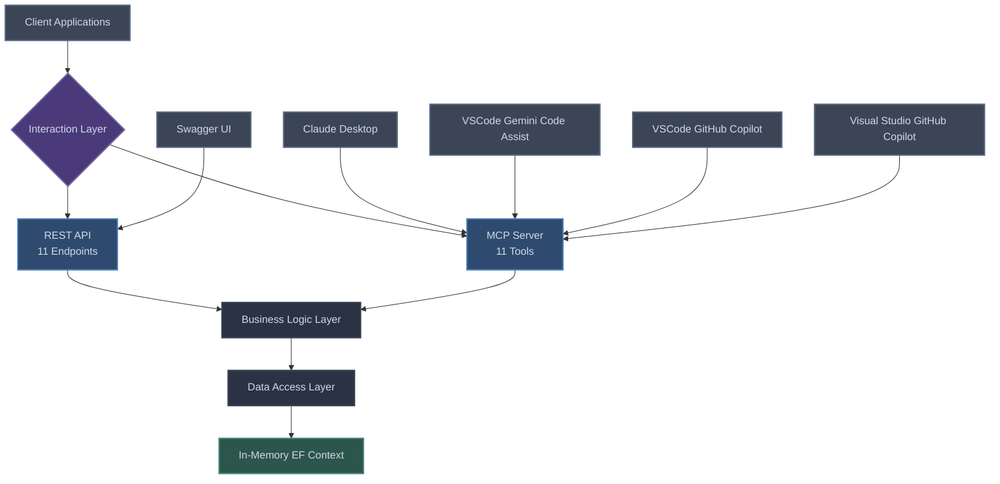
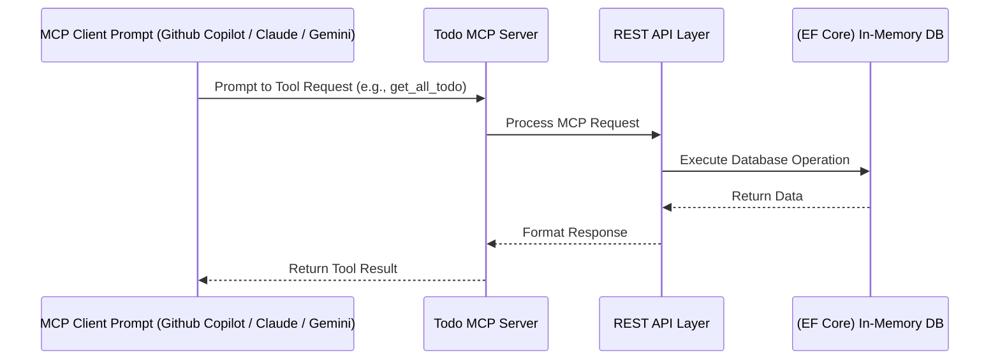
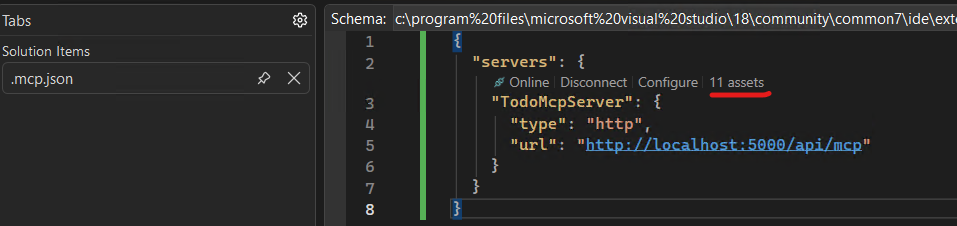
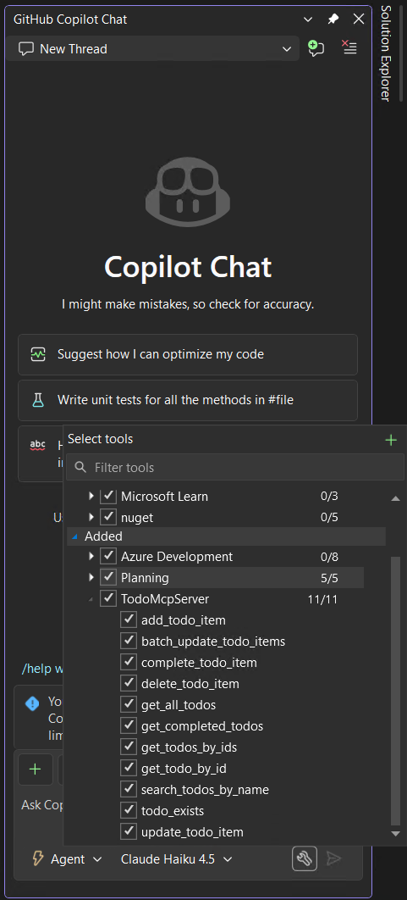
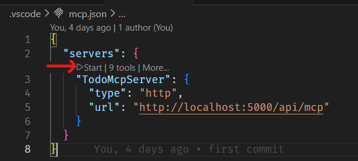
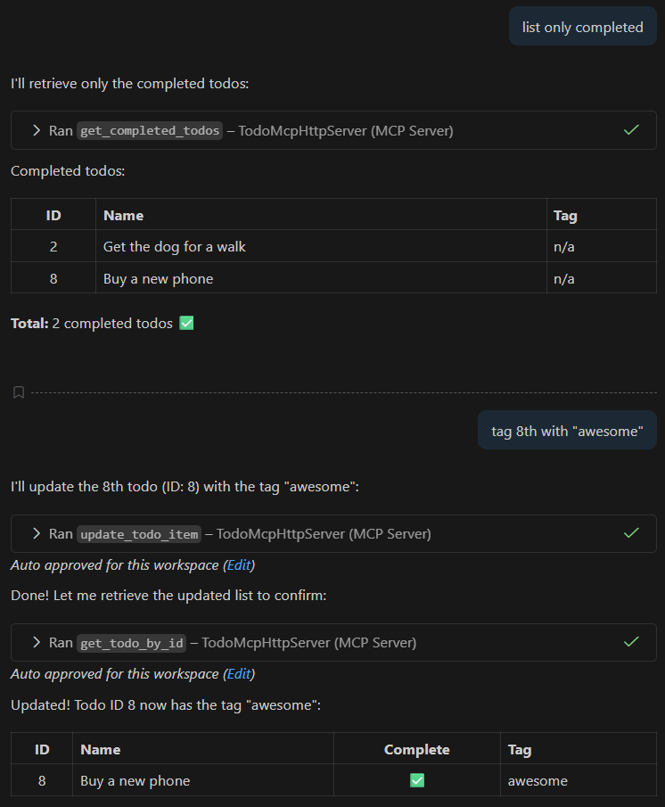
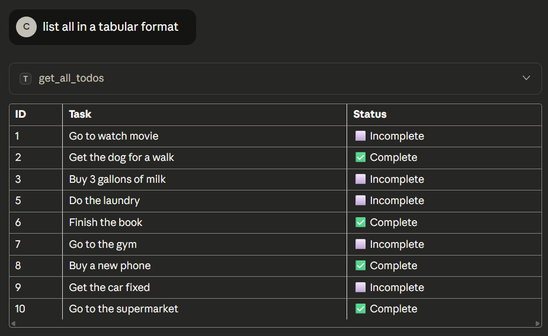
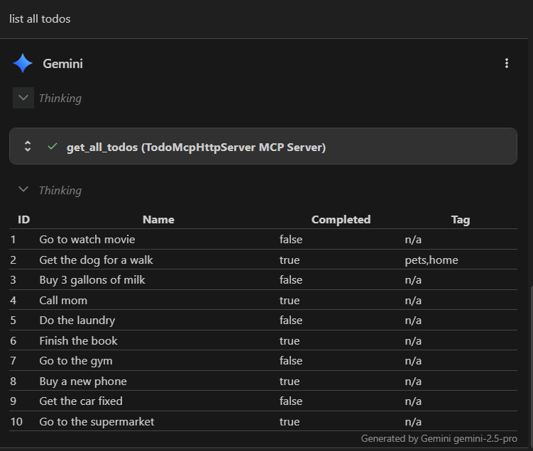
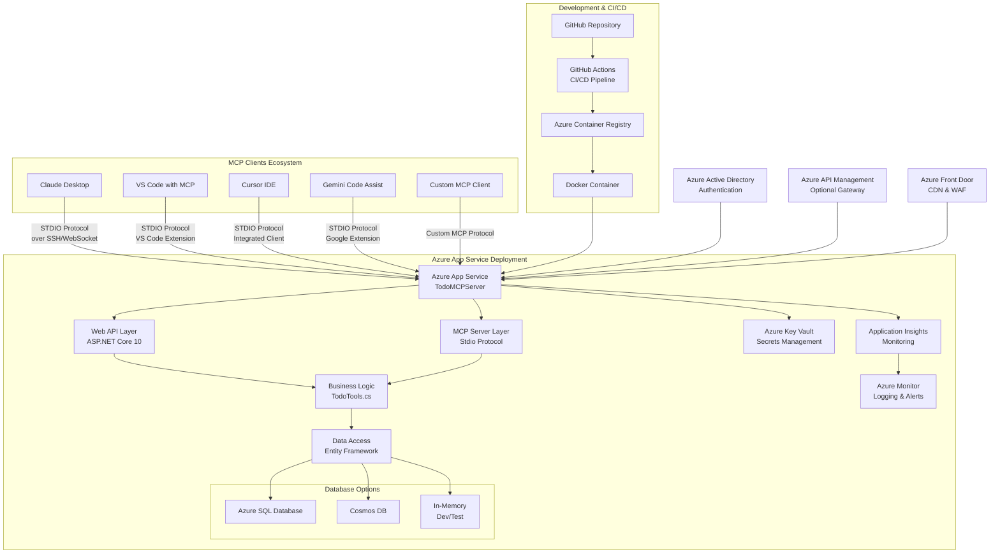
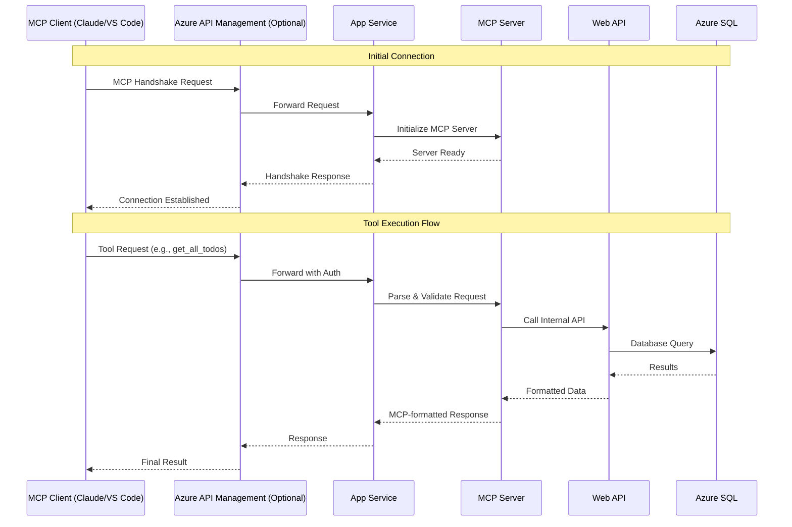

<!--
Prompt:

I have a github project at location: https://github.com/cpateldev/TodoMCPServer

This project uses Asp.net minimal web api targeting .Net 10 and addes MCP server support to todo minimal web api. It has total 11 REST endpoints and 11 MCP tools configured. The project has also mcp server settings files for VSCode, Gemini Code assist fro VSCode and Claude Desktop config to test MCP server tools to access Todo via web api.
The project is configured to use Todo db in memory EF context and has open api with Swagger UI support.

I want to generate detailed documentation for this project.
Section:

Overview
Features
Imgshields.io badges for .Net 10
PreRequisites
Nuget Package dependencies
How to run application
Web API REST endpoint details and how to call them via CURL, SwaggerUI
MCP Tools details
MCP json config files and its usage overview

Instructions:
- Use code and config files to generate documents. Do not add documentation for anything outside code and config files
- Use tabular format when applicable.
- Provide details of important code excerpts.
- Generate mermaid diagram for important flows if applicable
]: #
-->

# Todo MCP Server (.NET Minimal API with MCP server support)

## Table of contents

- [Todo MCP Server (.NET Minimal API with MCP server support)](#todo-mcp-server-net-minimal-api-with-mcp-server-support)
  - [Table of contents](#table-of-contents)
  - [Overview](#overview)
  - [Architecture Diagram](#architecture-diagram)
  - [Features](#features)
  - [Tools and MCP Clients](#tools-and-mcp-clients)
  - [Prerequisites](#prerequisites)
  - [Create a New Project named `TodoMCPServer`](#create-a-new-project-named-todomcpserver)
    - [Add Required NuGet Packages](#add-required-nuget-packages)
    - [Update `Program.cs` to Configure MCP Server](#update-programcs-to-configure-mcp-server)
    - [Map REST Endpoints and MCP Components](#map-rest-endpoints-and-mcp-components)
  - [How to Run the Application](#how-to-run-the-application)
    - [1. Clone and Navigate if you want to just try it out existing project](#1-clone-and-navigate-if-you-want-to-just-try-it-out-existing-project)
    - [2. Restore Dependencies](#2-restore-dependencies)
    - [3. Run the Application](#3-run-the-application)
    - [4. Access Interfaces](#4-access-interfaces)
    - [5. Alternative Launch Methods](#5-alternative-launch-methods)
  - [Package Dependencies](#package-dependencies)
  - [MCP Capabilities Summary](#mcp-capabilities-summary)
  - [Data Models](#data-models)
  - [Web API REST Endpoints](#web-api-rest-endpoints)
    - [Endpoint Details Table](#endpoint-details-table)
    - [Swagger UI Usage](#swagger-ui-usage)
  - [MCP Tools Details](#mcp-tools-details)
    - [MCP Tools Table](#mcp-tools-table)
    - [Prompt to Request Flow](#prompt-to-request-flow)
  - [MCP Prompts Details](#mcp-prompts-details)
    - [MCP Prompts Table](#mcp-prompts-table)
  - [MCP Resources Details](#mcp-resources-details)
    - [MCP Resources Table](#mcp-resources-table)
  - [Testing MCP Tools](#testing-mcp-tools)
    - [Visual Studio Github Copilot Configuration](#visual-studio-github-copilot-configuration)
      - [Visual Studio MCP support](#visual-studio-mcp-support)
    - [VS Code GitHub Copilot Configuration](#vs-code-github-copilot-configuration)
    - [GitHub Copilot responses to Todo MCP](#github-copilot-responses-to-todo-mcp)
    - [Claude Desktop Configuration](#claude-desktop-configuration)
      - [Claude Desktop response to Todo MCP](#claude-desktop-response-to-todo-mcp)
    - [Gemini Code Assist Configuration](#gemini-code-assist-configuration)
      - [Gemini Code Assists responses to Todo MCP](#gemini-code-assists-responses-to-todo-mcp)    
    - [Testing using MCP Inspector](#testing-using-mcp-inspector)
  - [Deploy to Azure App Service](#deploy-to-azure-app-service)
    - [Option A: Using Azure CLI](#option-a-using-azure-cli)
    - [Option B: Using Visual Studio](#option-b-using-visual-studio)
  - [Test Todo REST API in Azure](#test-todo-rest-api-in-azure)
  - [Secure Your Endpoint (Optional)](#secure-your-endpoint-optional)
  - [Monitor \& Scale](#monitor--scale)
  - [End to end flow diagram](#end-to-end-flow-diagram)
  - [Client communication flow](#client-communication-flow)
  - [Project Structure](#project-structure)
  - [Troubleshooting MCP Connections](#troubleshooting-mcp-connections)
  - [Security Notes](#security-notes)
  - [References](#references)

## Overview

TodoMCPServer is a modern .NET 10 application that combines a traditional REST API with **Model Context Protocol (MCP)** server capabilities for todo list management. The project serves as both a standard web API and an MCP-enabled service that can be integrated with AI assistants like Claude Desktop, Gemini Code Assist, GitHub Copilot, and other MCP-compatible tools.

This comprehensive implementation demonstrates how traditional REST APIs can be extended with AI agent tooling capabilities through MCP, allowing AI assistants to interact with your application directly. The project includes:

- **11 REST API endpoints** for traditional HTTP-based todo management
- **11 MCP tools** that mirror the REST endpoints for AI assistant integration
- **3 MCP prompts** providing AI-ready templates for task planning, review, and suggestions
- **4 MCP resources** offering URI-addressable read-only data access
- **Dual transport support** (HTTP and STDIO) for flexible deployment and integration
- **Multiple AI platform configurations** for Claude Desktop, VS Code, Visual Studio, and Gemini Code Assist

## Architecture Diagram


```mermaid
flowchart TD
    A[Client Applications] --> B{Interaction Layer}
    B --> C[REST API<br/>11 Endpoints]
    B --> D[MCP Server<br/>11 Tools]
    C --> E[Business Logic Layer]
    D --> E
    E --> F[Data Access Layer]
    F --> G[In-Memory EF Context]

    H[Swagger UI] --> C
    I[Claude Desktop] --> D
    J[VSCode Gemini Code Assist] --> D
    K[VSCode GitHub Copilot] --> D
    L[Visual Studio GitHub Copilot] --> D

    classDef client fill:#3c4556,stroke:#5d6b84,stroke-width:2px,color:#d1d9e8
    classDef layer fill:#2a3244,stroke:#3c4556,stroke-width:2px,color:#d1d9e8
    classDef interface fill:#2e4a6e,stroke:#4a7bb9,stroke-width:2px,color:#d1d9e8
    classDef decision fill:#4a3a7a,stroke:#7b6aa8,stroke-width:2px,color:#d1d9e8
    classDef data fill:#2c554c,stroke:#4a8c7d,stroke-width:2px,color:#d1d9e8

    class A client
    class H,I,J,K,L client

    class B decision

    class C,D interface
    class E,F layer
    class G data
```

## Features

- **Dual Interface**: Both REST API (11 endpoints) and MCP server (11 tools, 3 prompts, 4 resources)
- **Modern Stack**: .NET 10 with Minimal API architecture
- **Database**: Entity Framework Core with In-Memory DB provider
- **API Documentation**: OpenAPI/Swagger UI integration with Scalar
- **MCP Server Support**: MCP Server support using both HTTP and STDIO transport types
- **MCP Integration**: Pre-configured with Claude Desktop, Gemini Code Assist, Visual Studio Github Copilot, and VSCode GitHub Copilot for major AI development tools
- **MCP Inspector Support**: Easily test MCP tools using MCP Inspector using HTTP or STDIO transport types
- **AI-Ready Prompts**: 3 built-in prompt templates for LLM-powered task management
- **Resource Endpoints**: 4 URI-addressable read-only resources for data access
- **Cross-Platform**: Runs on any platform supporting .NET 10

## Tools and MCP Clients

[](https://dotnet.microsoft.com/en-us/download/dotnet/10.0)
[](https://learn.microsoft.com/en-us/ef/core/)
[](https://dotnet.microsoft.com/en-us/apps/aspnet)
[](https://swagger.io/specification/)
[](https://swagger.io/tools/swagger-ui/)
[](https://modelcontextprotocol.io/)

[](https://claude.ai/)
[](https://visualstudio.microsoft.com/)
[](https://code.visualstudio.com/)
[](https://developers.google.com/gemini)

## Prerequisites

- **.NET 10 SDK** or later
- **Visual Studio 2025+** or **VS Code** with C# Dev Kit
- **Git** for version control
- For MCP testing: **GitHub Copilot in VS Code**, **Claude Desktop**, **Gemini Code Assist**, or any MCP-compatible client

## Create a New Project named `TodoMCPServer`

```bash
dotnet new webapi -n TodoMCPServer
cd TodoMCPServer
```

### Add Required NuGet Packages

Install the required packages with the following commands:

Here are the NuGet packages used in this project:

| Package                                                | Version   | Description                                                                                              |
| ------------------------------------------------------ | --------- | -------------------------------------------------------------------------------------------------------- |
| `Microsoft.AspNetCore.Diagnostics.EntityFrameworkCore` | `10.0.8`  | ASP.NET Core middleware for Entity Framework Core error pages.                                           |
| `Microsoft.AspNetCore.OpenApi`                         | `10.0.8`  | Provides APIs for generating and serving OpenAPI documents for web APIs built with ASP.NET Core.         |
| `Microsoft.EntityFrameworkCore.InMemory`               | `10.0.8`  | Entity Framework Core in-memory database provider.                                                       |
| `ModelContextProtocol`                                 | `1.3.0`   | A protocol for synchronizing models between a client and a server. `(not needed in this project)`        |
| `ModelContextProtocol.AspNetCore`                      | `1.3.0`   | ASP.NET Core middleware for `ModelContextProtocol`.                                                      |
| `Scalar.AspNetCore`                                    | `2.14.14` | Middleware to expose an embedded version of the Swagger UI to visualize and interact with your web APIs. |

> See comparison between `ModelContextProtocol` vs `ModelContextProtocol.AspNetCore` **[here](ReadMe-MCPPackagesOverview.md)**

Install these packages with:

```bash
dotnet add package Microsoft.AspNetCore.Diagnostics.EntityFrameworkCore --version 10.0.8
dotnet add package Microsoft.AspNetCore.OpenApi --version 10.0.8
dotnet add package Microsoft.EntityFrameworkCore.InMemory --version 10.0.8
dotnet add package ModelContextProtocol.AspNetCore --version 1.3.0
dotnet add package ModelContextProtocol --version 1.3.0
dotnet add package Scalar.AspNetCore --version 2.14.14
```

> Note: ModelContextProtocol is not actually needed for ASP.NET Core projects when using ModelContextProtocol.AspNetCore.

## MCP Capabilities Summary

This project demonstrates three key MCP primitives:

| MCP Component | Count | Purpose                                  | Implementation File      |
| ------------- | ----- | ---------------------------------------- | ------------------------ |
| **Tools**     | 11    | Executable functions for todo operations | `Tools/TodoService.cs`   |
| **Prompts**   | 3     | AI-ready templates for task management   | `Tools/TodoPrompts.cs`   |
| **Resources** | 4     | URI-addressable read-only data endpoints | `Tools/TodoResources.cs` |

**Total MCP Capabilities: 18**

- Tools enable AI assistants to perform actions (CRUD operations on todos)
- Prompts provide contextual templates for LLM-powered planning and suggestions
- Resources offer read-only data access via custom URI schemes

## Data Models

### Todo Entity

The core `Todo` entity includes an owned `Tag` entity:

```csharp
public class Todo
{
    public int Id { get; set; }
    public string? Name { get; set; }
    public bool IsComplete { get; set; }

    // Owned entity - stored in the same table
    public Tag Tag { get; set; } = new();
}

[Owned]
public class Tag
{
    public string? Name { get; set; } = "n/a";

    public static bool TryParse(string? name, out Tag tag)
    {
        if (name is null)
        {
            tag = default!;
            return false;
        }
        tag = new Tag { Name = name };
        return true;
    }
}
```

### TodoDb Context

The in-memory database context is minimal:

```csharp
public class TodoDb : DbContext
{
    public TodoDb(DbContextOptions<TodoDb> options) : base(options) { }

    public DbSet<Todo> Todos => Set<Todo>();
}
```

### TodoItemDTO

Data Transfer Object for API responses:

```csharp
public class TodoItemDTO
{
    public int Id { get; set; }
    public string? Name { get; set; }
    public bool IsComplete { get; set; }

    public TodoItemDTO() { }
    public TodoItemDTO(Todo todoItem) =>
        (Id, Name, IsComplete) = (todoItem.Id, todoItem.Name, todoItem.IsComplete);
}
```

**Seed Data:**

The application seeds 10 sample todos on startup:

- 5 completed items
- 5 pending items

### Update `Program.cs` to Configure MCP Server

The MCP server is configured in `Program.cs` with full support for tools, prompts, and resources:

```csharp
builder.Services
    .AddMcpServer()                 // Add MCP server capabilities
    .WithStdioServerTransport()     // Use stdio transport for local AI clients
    .WithHttpTransport()            // Use HTTP transport for web-based clients
    .WithToolsFromAssembly()        // Automatically register all MCP tools
    .WithPromptsFromAssembly()      // Automatically register all MCP prompts
    .WithResourcesFromAssembly();   // Automatically register all MCP resources
```

**Important Notes:**

- `WithStdioServerTransport()` enables stdio communication for Claude Desktop and local MCP clients
- `WithHttpTransport()` enables HTTP endpoint for web-based MCP clients and Azure deployments
- `WithToolsFromAssembly()` scans for classes marked with `[McpServerToolType]` and methods with `[McpServerTool]`
- `WithPromptsFromAssembly()` scans for classes marked with `[McpServerPromptType]` and methods with `[McpServerPrompt]`
- `WithResourcesFromAssembly()` scans for classes marked with `[McpServerResourceType]` and methods with `[McpServerResource]`

> [!WARNING]
> When deploying to Azure App Service, comment out `.WithStdioServerTransport()` as stdio transport is not supported in cloud environments.

### Map REST Endpoints and MCP Components

The project includes three key components for MCP integration:

**1. Tools (Tools\TodoService.cs)** - MCP tools that mirror REST API functionality:

```csharp
using ModelContextProtocol.Server;
using System.ComponentModel;
using Microsoft.EntityFrameworkCore;

public static class TodoService
{
    public static void MapEndPoints(this IEndpointRouteBuilder app)
    {
        app.MapGroup("/todoitems")
            .WithTags("Todo Items")
            .WithSummary("Manage Todo Items");

        app.MapGet("/", TodoTools.GetAllTodos)
            .WithSummary("Get All Todo Items");

        // Additional endpoints...
    }
}

[McpServerToolType]
public static class TodoTools
{
    [McpServerTool(Name = "get_all_todos"), Description("Retrieve all todo items optionally filtered by status.")]
    public static async Task<IResult> GetAllTodos(string? status, TodoDb db)
    {
        if (string.Equals(status, "completed", StringComparison.OrdinalIgnoreCase))
        {
            return TypedResults.Ok(await db.Todos.Where(t => t.IsComplete).ToListAsync());
        }
        return TypedResults.Ok(await db.Todos.ToListAsync());
    }
    // Other tool implementations...
}
```

**2. Prompts (Tools\TodoPrompts.cs)** - AI-ready prompt templates:

```csharp
using ModelContextProtocol.Server;
using ModelContextProtocol.Protocol;

[McpServerPromptType]
public static class TodoPrompts
{
    [McpServerPrompt(Name = "daily_planner"), Description("Generate a daily plan based on pending todos.")]
    public static async Task<IEnumerable<PromptMessage>> DailyPlanner(
        IServiceProvider serviceProvider,
        string? focusArea,
        CancellationToken cancellationToken)
    {
        var db = serviceProvider.GetRequiredService<TodoDb>();
        var pendingTodos = await db.Todos.Where(t => !t.IsComplete).ToListAsync(cancellationToken);
        // Build and return prompt messages...
    }
    // Other prompt implementations...
}
```

**3. Resources (Tools\TodoResources.cs)** - URI-addressable data endpoints:

```csharp
using ModelContextProtocol.Server;
using System.Text.Json;

[McpServerResourceType]
public static class TodoResources
{
    [McpServerResource(UriTemplate = "todo://all", Name = "all_todos", MimeType = "application/json"),
     Description("All todo items in the system.")]
    public static async Task<string> GetAllTodos(TodoDb db, CancellationToken cancellationToken)
    {
        var todos = await db.Todos.ToListAsync(cancellationToken);
        return JsonSerializer.Serialize(todos.Select(t => new TodoItemDTO(t)), JsonOptions);
    }
    // Other resource implementations...
}
```

## How to Run the Application

### 1. Clone and Navigate if you want to just try it out existing project

```bash
git clone https://github.com/cpateldev/TodoMCPServer.git
cd TodoMCPServer
```

### 2. Restore Dependencies

```bash
dotnet restore
```

### 3. Run the Application

```bash
dotnet run
# or for development with hot reload
dotnet watch run
```

### 4. Access Interfaces

- **Swagger UI**: http://localhost:5000/scalar/v1
- **REST API**: http://localhost:5000/
- **MCP Server**: Available via stdio transport on port 5000

### 5. Alternative Launch Methods

- **Visual Studio**: Open `TodoMCPServer.sln` and press F5
- **VS Code**: Open folder and use `.NET Core Launch` configuration

## Web API REST Endpoints

The API follows RESTful conventions with 11 endpoints for comprehensive Todo management.

### Endpoint Details Table

| #   | HTTP Method | Endpoint                       | Description               | Parameters                                     | Request Body                   | Response Type                |
| --- | ----------- | ------------------------------ | ------------------------- | ---------------------------------------------- | ------------------------------ | ---------------------------- |
| 1   | **GET**     | `/todoitems/`                  | Get all todo items        | `status` (query, optional) - Filter by status  | None                           | Array of `Todo`              |
| 2   | **POST**    | `/todoitems/{id}/changestatus` | Change todo item status   | `id` (path, required), `isComplete` (optional) | None                           | Single `Todo`                |
| 3   | **GET**     | `/todoitems/completed`         | Get all completed todos   | None                                           | None                           | Array of `Todo`              |
| 4   | **GET**     | `/todoitems/{id}`              | Get a specific todo by ID | `id` (path, required) - Todo ID                | None                           | Single `Todo`                |
| 5   | **GET**     | `/todoitems/ids`               | Get multiple todos by IDs | `ids` (query, required) - Array of IDs         | None                           | Array of `Todo`              |
| 6   | **GET**     | `/todoitems/search/{name}`     | Search todos by name      | `name` (path, required) - Search term          | None                           | Array of `Todo`              |
| 7   | **POST**    | `/todoitems/add`               | Add a new todo item       | None                                           | `Todo` object                  | Single `Todo`                |
| 8   | **PATCH**   | `/todoitems/update/{id}`       | Update a specific todo    | `id` (path, required) - Todo ID                | `Todo` object (partial update) | Single `Todo`                |
| 9   | **POST**    | `/todoitems/batchupdate`       | Batch update todo items   | None                                           | Array of `Todo` objects        | Array of `Todo`              |
| 10  | **DELETE**  | `/todoitems/delete/{id}`       | Delete a specific todo    | `id` (path, required) - Todo ID                | None                           | Single `Todo` (deleted item) |
| 11  | **GET**     | `/todoitems/exists/{id}`       | Check if a todo exists    | `id` (path, required) - Todo ID                | None                           | `boolean`                    |

### Scalar API Explorer Usage

1. Open [http://localhost:5000/scalar/v1](http://localhost:5000/scalar/v1) in your browser.
2. Browse the list of available REST endpoints.
3. Click any endpoint to view details, parameters, and example payloads.
4. Select "Try it out" to send live requests and see real-time responses.
5. Review request/response schemas and example data for each endpoint.

> Scalar UI provides an interactive OpenAPI/Swagger experience for testing and exploring your API.

## MCP Tools Details

The MCP server provides 11 tools that mirror the REST API functionality, enabling AI assistants to interact with the Todo system.

### MCP Tools Table

| #   | Tool Name                              | Description                                                                                                 | Input Parameters                                        | Return Type | HTTP Equivalent                   |
| --- | -------------------------------------- | ----------------------------------------------------------------------------------------------------------- | ------------------------------------------------------- | ----------- | --------------------------------- |
| 1   | **get_all_todos**                      | Retrieve all todo items optionally filtered by status.                                                      | `status` (string, optional)                             | List<Todo>  | GET /todoitems/                   |
| 2   | **get_todo_by_id**                     | Retrieve a todo item by its ID.                                                                             | `id` (int)                                              | Todo        | GET /todoitems/{id}               |
| 3   | **get_todos_by_ids**                   | Retrieve multiple todo items by their IDs.                                                                  | `ids` (int[])                                           | List<Todo>  | GET /todoitems/ids                |
| 4   | **search_todos_by_name**               | Search todo items by name.                                                                                  | `name` (string)                                         | List<Todo>  | GET /todoitems/search/{name}      |
| 5   | **add_todo_item**                      | Add a new todo item.                                                                                        | `todo` (Todo)                                           | Todo        | POST /todoitems/add               |
| 6   | **update_todo_item**                   | Update an existing todo item by id.                                                                         | `id` (int), `inputTodo` (Todo)                          | Todo        | PATCH /todoitems/update/{id}      |
| 7   | **batch_update_todo_items**            | Batch update todo items.                                                                                    | `todos` (Todo[])                                        | List<Todo>  | POST /todoitems/batchupdate       |
| 8   | **delete_todo_item**                   | Delete a todo item by its ID.                                                                               | `id` (int)                                              | Todo        | DELETE /todoitems/delete/{id}     |
| 9   | **get_completed_todos**                | Retrieve all completed todo items.                                                                          | None                                                    | List<Todo>  | GET /todoitems/completed          |
| 10  | **change_iscomplete_status_todo_item** | Change the isComplete status of a todo item by its ID with optional isComplete parameter (default is true). | `id` (int), `isComplete` (bool, optional, default true) | Todo        | POST /todoitems/{id}/changestatus |
| 11  | **todo_exists**                        | Check if a todo item exists by its ID.                                                                      | `id` (int)                                              | bool        | GET /todoitems/exists/{id}        |

### Prompt to Request Flow


```mermaid
sequenceDiagram
    participant Client as MCP Client Prompt (Github Copilot / Claude / Gemini)
    participant MCPServer as Todo MCP Server
    participant API as REST API Layer
    participant DB as (EF Core) In-Memory DB

    Client->>MCPServer: Prompt to Tool Request (e.g., get_all_todo)
    MCPServer->>API: Process MCP Request
    API->>DB: Execute Database Operation
    DB-->>API: Return Data
    API-->>MCPServer: Format Response
    MCPServer-->>Client: Return Tool Result
```

## MCP Prompts Details

The MCP server provides 3 AI-ready prompt templates that help generate contextual todo management prompts for LLMs.

### MCP Prompts Table

| #   | Prompt Name           | Description                                                                   | Input Parameters               | Return Type                | Use Case                                          |
| --- | --------------------- | ----------------------------------------------------------------------------- | ------------------------------ | -------------------------- | ------------------------------------------------- |
| 1   | **daily_planner**     | Generate a daily plan based on pending todos with an optional focus area.     | `focusArea` (string, optional) | IEnumerable<PromptMessage> | Create prioritized daily plans from pending tasks |
| 2   | **todo_review**       | Review all todos (completed and pending) and recommend next actions.          | None                           | IEnumerable<PromptMessage> | Get productivity assessment and recommendations   |
| 3   | **suggest_new_todos** | Suggest 3-5 new todo items based on existing todos and user-provided context. | `context` (string, required)   | IEnumerable<PromptMessage> | Generate contextual task suggestions              |

**Example Usage:**

```text
# Using daily_planner prompt
"Generate my daily plan focusing on work items"

# Using todo_review prompt
"Review my todos and suggest what I should prioritize"

# Using suggest_new_todos prompt
"Suggest new todos for preparing for a trip"
```

## MCP Resources Details

The MCP server provides 4 URI-addressable resources that expose todo data as read-only endpoints.

### MCP Resources Table

| #   | Resource Name     | URI Template       | MIME Type          | Description                                               | Use Case                          |
| --- | ----------------- | ------------------ | ------------------ | --------------------------------------------------------- | --------------------------------- |
| 1   | **all_todos**     | `todo://all`       | `application/json` | All todo items in the system.                             | Get complete todo list as JSON    |
| 2   | **pending_todos** | `todo://pending`   | `application/json` | Pending (incomplete) todo items.                          | Get only incomplete tasks         |
| 3   | **todo_stats**    | `todo://stats`     | `text/plain`       | Summary statistics: total, completed, and pending counts. | Quick overview of todo statistics |
| 4   | **todo_by_id**    | `todo://item/{id}` | `application/json` | A single todo item by its ID.                             | Retrieve specific todo by ID      |

**Example Resource URIs:**

```text
todo://all          - Returns all todos as JSON array
todo://pending      - Returns only pending todos
todo://stats        - Returns "Total: 10, Completed: 5, Pending: 5"
todo://item/3       - Returns todo with ID 3 as JSON object
```

**Code Example:**

```csharp
[McpServerResource(UriTemplate = "todo://all", Name = "all_todos", MimeType = "application/json"),
 Description("All todo items in the system.")]
public static async Task<string> GetAllTodos(TodoDb db, CancellationToken cancellationToken)
{
    var todos = await db.Todos.ToListAsync(cancellationToken);
    return JsonSerializer.Serialize(todos.Select(t => new TodoItemDTO(t)), JsonOptions);
}
```
## Testing MCP Tools

1. **Start the server**: `dotnet run` or `dotnet watch`
2. **Connect a client** using one of the configs above
3. **Test with natural language**:
   - "get all todos"
   - "Create a todo for fixing the bug report"
   - "Mark todo #3 as complete"

### Visual Studio Github Copilot Configuration

> Visual Studio supports MCP integration using both HTTP and stdio transport types.
> Create a new file: `<SOLUTIONDIR>\.mcp.json` or `%USERPROFILE%\.mcp.json`. We recommend that you use Visual Studio to edit this file so that its JSON schema is automatically applied.

**Transport type: `http`**

```json
{
  "servers": {
    "TodoMcpServer": {
      "type": "http",
      "url": "http://localhost:5000/api/mcp"
    }
  }
}
```

#### Visual Studio MCP support





**Usage with Visual Studio GitHub Copilot: `http`:**

1. Only works in Visual Studio 2026.
2. Place config in `.mcp.json` file in solution directory or user profile directory.
3. Run project using VS 2026 or using `dotnet run` or `dotnet watch` commands
4. Click `Start` link above json block in `.mcp.json`
5. Access todo tools via GitHub Copilot AI assistant panel shown in above image


### VS Code GitHub Copilot Configuration

> VS Code supports MCP integration using both HTTP and stdio transport types.
>
> `.vscode\mcp.json`

**Transport type: `http`**

```json
{
  "servers": {
    "TodoMcpServer": {
      "type": "http",
      "url": "http://localhost:5000/api/mcp"
    }
  }
}
```



**Usage with VS Code GitHub Copilot: `http`:**

1. Make sure chat.mcp.enabled is true in VS Code settings.
2. Place config in `.vscode\mcp.json`. See VSCode MCP docs for more details.
3. Run project using `dotnet run` or `dotnet watch` command
4. Click `Start` link above json block in `.vscode\mcp.json`
5. Access todo tools via AI assistant panel

**Transport type: stdio**

```json
{
  "servers": {
    "TodoMcpHttpServer": {
      "type": "stdio",
      "command": "dotnet",
      "args": ["run", "--project", "ToDoMCPServer.csproj"]
    }
  }
}
```

**Usage with VS Code GitHub Copilot: `stdio`**

1. Make sure chat.mcp.enabled is true in VS Code settings.
2. Place config in `.vscode\mcp.json`. See VSCode MCP docs for more details.
3. Click `Start` link above json block in `.vscode\mcp.json`

- DONT NEED TO run project using `dotnet run` or `dotnet watch` command as stdio transport will start the project

4. Wait for "MCP server started" message in output console
5. Access todo tools via GitHub Copilot AI assistant panel

#### GitHub Copilot responses to Todo MCP



### Claude Desktop Configuration

**Transport type: `stdio`**

> `claude-desktop-config.json`

```json
{
  "mcpServers": {
    "TodoMcpHttpServer": {
      "type": "stdio",
      "command": "dotnet",
      "args": [
        "run",
        "--project",
        "<path to project directory>\\TodoMCPServer.csproj"
      ]
    }
  }
}
```

Claude Desktop now support http transport as well as long as URL is https and not http. for non https URL, use npx command shown in next section.

> **Transport type: `http`**

```json
{
  "mcpServers": {
    "weatherMCPApp": {
      "type": "http",
      "url": "https://localhost:5000/api/mcp"
    }
  }
}
```

Alternatively, you can target non https URL using npx command as shown below, but you won't get real-time logs in this case and you must start the server first using `dotnet run` command.

> **Transport type: `http` using npx command**

```json
{
  "mcpServers": {
    "weatherMCPApp": {
      "command": "npx",
      "args": ["mcp-remote", "http://localhost:7071/runtime/webhooks/mcp"]
    }
  }
}
```

**Usage with Claude Desktop:**

1. Locate Claude config: `~/Library/Application Support/Claude/claude_desktop_config.json` (macOS) or `%APPDATA%\Claude\claude_desktop_config.json` (Windows)
2. Update configuration with existing settings shown above. Make sure to provide full path to `TodoMCPServer.csproj`
3. Restart Claude Desktop
4. Use natural language like "Show me all my todos" or "Create a new todo for meeting tomorrow"

#### Claude Desktop response to Todo MCP



### Gemini Code Assist Configuration

** Transport type: `stdio only` **

> `.gemini\settings.json`

```json
{
  "mcpServers": {
    "TodoMcpHttpServer": {
      "type": "stdio",
      "command": "dotnet",
      "args": ["run", "--project", "ToDoMCPServer.csproj"]
    }
  }
}
```

**Usage with Gemini Code Assist:**

1. Open VS Code > Gemini Code Assist chat window
2. Enter /mcp
3. Open command palette (`Ctrl + Shift + P`) and select `Developer: Reload Windows` option.
4. Gemini Code Assist will show MCP servers from settings.json. 11 tools will be shown in this case

#### Gemini Code Assists responses to Todo MCP



### Testing using MCP Inspector

1. Testing with MCP Inspector
   - Use [MCP Inspector](https://modelcontextprotocol.io/tools/mcp-inspector) to test MCP tools directly by sending requests and viewing responses.
   - Configure MCP Inspector to connect to the TodoMCPServer using HTTP or stdio transport as per your setup.
2. Run MCP Inspector and connect to the Todo MCP server
   - Open PowerShell or terminal and run `npx -y @modelcontextprotocol/inspector` command, see below examples for http and stdio transport
   - This should open MCP Inspector UI in browser
   - Configure connection to Todo MCP server using HTTP or stdio transport shown in images below

**Testing using MCP Inspector - HTTP**

> MCP Inspector Command for `HTTP` transport:
>
> > For http transport use: `http://localhost:5000/api/mcp`, you must start the server first using `dotnet run` command.

```bash
npx -y @modelcontextprotocol/inspector http http://localhost:5000/api/mcp
```


**Testing using MCP Inspector - STDIO**

> MCP Inspector Command for `STDIO` transport:
>
> > For stdio transport: click `Connect` button from MCP Inspector UI, no need to start the server first as stdio transport will start the server process.
>
> Make sure your shell's or terminal's current directory is project directory where `ToDoMCPServer.csproj` file is located.

```bash
npx -y @modelcontextprotocol/inspector stdio "dotnet run --project ToDoMCPServer.csproj"
```


---

## Deploy to Azure App Service

### Option A: Using Azure CLI

1. Login:
   ```bash
   az login
   ```
2. Create resource group:
   ```bash
   az group create --name TodoMcpRG --location eastus
   ```
3. Deploy App Service:
   ```bash
   az webapp up --runtime "DOTNET|10.0" --sku B1 \
     --name TodoMcpServerApp --resource-group TodoMcpRG
   ```

This command builds, publishes, and deploys your app.

---

### Option B: Using Visual Studio

- Configure Publish Profile in Visual Studio.
- Right‑click project → **Publish** → **Azure App Service (Windows/Linux)**.
- Select subscription, resource group, and App Service plan.
- Publish.

---

## Test Todo REST API in Azure

- REST:
  ```bash
  curl https://TodoMcpServerApp.azurewebsites.net/todos
  ```
- MCP tools:
  - `get_todos` → returns items
  - `add_todo` → adds new item

---

## Secure Your Endpoint (Optional)

Add JWT/OAuth authentication:

```csharp
builder.Services.AddAuthentication(JwtBearerDefaults.AuthenticationScheme)
    .AddJwtBearer(options =>
    {
        options.Authority = "https://login.microsoftonline.com/<tenant-id>/v2.0";
        options.Audience = "<app-client-id>";
    });

builder.Services.AddAuthorization();

app.MapMcp("api/mcp").RequireAuthorization();
```

Then configure Azure AD App Registration for your server.

---

## Monitor & Scale

- Enable **Application Insights** for logging MCP requests.
- Configure **autoscaling** in App Service Plan for load handling.

---

## End to end flow diagram


```mermaid
flowchart TD
    subgraph "MCP Clients Ecosystem"
        A[Claude Desktop]
        B[VS Code with MCP]
        C[Cursor IDE]
        D[Gemini Code Assist]
        E[Custom MCP Client]
    end

    subgraph "Azure App Service Deployment"
        F[Azure App Service<br/>TodoMCPServer]
        G[Web API Layer<br/>ASP.NET Core 10]
        H[MCP Server Layer<br/>Stdio Protocol]
        I[Business Logic<br/>TodoTools.cs]
        J[Data Access<br/>Entity Framework]

        subgraph "Database Options"
            K1[Azure SQL Database]
            K2[Cosmos DB]
            K3[In-Memory<br/>Dev/Test]
        end

        L[Azure Key Vault<br/>Secrets Management]
        M[Application Insights<br/>Monitoring]
        N[Azure Monitor<br/>Logging & Alerts]
    end

    subgraph "Development & CI/CD"
        O[GitHub Repository]
        P[GitHub Actions<br/>CI/CD Pipeline]
        Q[Azure Container Registry]
        R[Docker Container]
    end

    %% Client Connections
    A -->|STDIO Protocol<br/>over SSH/WebSocket| F
    B -->|STDIO Protocol<br/>VS Code Extension| F
    C -->|STDIO Protocol<br/>Integrated Client| F
    D -->|STDIO Protocol<br/>Google Extension| F
    E -->|Custom MCP Protocol| F

    %% Internal Azure Flow
    F --> G
    F --> H
    G --> I
    H --> I
    I --> J
    J --> K1
    J --> K2
    J --> K3

    %% Security & Monitoring
    F --> L
    F --> M
    M --> N

    %% Deployment Flow
    O --> P
    P --> Q
    Q --> R
    R --> F

    %% External Services
    S[Azure Active Directory<br/>Authentication]
    T[Azure API Management<br/>Optional Gateway]
    U[Azure Front Door<br/>CDN & WAF]

    S --> F
    T --> F
    U --> F
```

## Client communication flow


```mermaid
sequenceDiagram
    participant C as MCP Client (Claude/VS Code)
    participant APIM as Azure API Management (Optional)
    participant AS as App Service
    participant MCP as MCP Server
    participant API as Web API
    participant DB as Azure SQL

    Note over C,DB: Initial Connection
    C->>APIM: MCP Handshake Request
    APIM->>AS: Forward Request
    AS->>MCP: Initialize MCP Server
    MCP-->>AS: Server Ready
    AS-->>APIM: Handshake Response
    APIM-->>C: Connection Established

    Note over C,DB: Tool Execution Flow
    C->>APIM: Tool Request (e.g., get_all_todos)
    APIM->>AS: Forward with Auth
    AS->>MCP: Parse & Validate Request
    MCP->>API: Call Internal API
    API->>DB: Database Query
    DB-->>API: Results
    API-->>MCP: Formatted Data
    MCP-->>AS: MCP-formatted Response
    AS-->>APIM: Response
    APIM-->>C: Final Result
```

## Project Structure

```plaintext
TodoMCPServer/
├── .github/                        # GitHub-specific files (instructions, agents)
│   ├── agents/                     # Custom agent configurations
│   │   └── csharp-mcp-expert.agent.md
│   └── instructions/               # Coding guidelines and instructions
│       ├── aspnet-rest-apis.instructions.md
│       ├── csharp-mcp-server.instructions.md
│       ├── csharp.instructions.md
│       └── markdown.instructions.md
├── .vscode/                        # VS Code configuration
│   └── mcp.json                    # MCP configuration for VS Code GitHub Copilot
├── bin/                            # Compiled binaries (Debug/Release)
│   ├── Debug/
│   │   └── net10.0/
│   │       ├── appsettings.json
│   │       ├── appsettings.Development.json
│   │       ├── TodoMCPServer.deps.json
│   │       ├── TodoMCPServer.runtimeconfig.json
│   │       ├── TodoMCPServer.staticwebassets.endpoints.json
│   │       ├── app/
│   │       └── ClaudeDesktopConfig/
│   │           └── claude_desktop_config.json
│   └── Release/
│       └── net10.0/
│           ├── publish/
│           └── ClaudeDesktopConfig/
├── ClaudeDesktopConfig/            # Claude Desktop MCP configuration
│   └── claude_desktop_config.json  # MCP config for Claude Desktop
├── images/                         # Documentation images and screenshots
│   ├── ClaudeDesktopMCPResponse.png
│   ├── GeminiCodeAssistsMCPResponse.png
│   ├── GithubCopilotMCPResponses.png
│   ├── MCP Inspector HTTP.png
│   ├── MCP Inspector STDIO.png
│   ├── GitHubCopilotHTTPMCPStart.png
│   ├── VisualStudioGitHubCopilotMCPTools.png
│   └── VisualStudioMCPJSOn.png
├── Model/                          # Data models and database context
│   ├── ToDo.cs                     # Todo entity with Tag owned entity
│   ├── ToDoDb.cs                   # EF Core DbContext (in-memory)
│   └── TodoItemDTO.cs              # Data Transfer Object for API responses
├── obj/                            # Build intermediates (auto-generated)
│   ├── Debug/
│   │   └── net10.0/
│   └── Release/
│       └── net10.0/
├── Properties/                     # Project properties
│   └── launchSettings.json         # Development launch profiles
├── Tools/                          # MCP tools, prompts, and resources
│   ├── TodoService.cs              # REST API endpoints + MCP Tools (11 tools)
│   ├── TodoPrompts.cs              # MCP Prompts (3 prompts for AI assistants)
│   └── TodoResources.cs            # MCP Resources (4 URI-addressable resources)
├── .mcp.json                       # MCP config for Visual Studio 2026 GitHub Copilot
├── appsettings.json                # Application configuration
├── appsettings.Development.json    # Development environment configuration
├── Program.cs                      # Application entry point and MCP setup
├── ReadMe-MCPPackagesOverview.md   # MCP packages comparison documentation
├── ReadMe-MCPTransportOptions.md   # MCP transport options documentation
├── Readme.md                       # Main project documentation (this file)
├── Readme.StepbyStepCode.md        # Step-by-step coding guide
├── TodoMCPServer.csproj            # .NET project file
├── TodoMCPServer.sln               # Visual Studio solution file
└── TodoMCPServer.http              # HTTP request collection for testing
```

**Key Folders:**

- **Model/** - Contains the domain entities (`Todo`, `Tag`) and EF Core database context
- **Tools/** - Houses all MCP-related implementations (tools, prompts, resources)
- **ClaudeDesktopConfig/** - Pre-configured MCP settings for Claude Desktop integration
- **.vscode/** - MCP configuration for VS Code with GitHub Copilot
- **images/** - Screenshots and diagrams for documentation

**Configuration Files:**

- `.mcp.json` - MCP server configuration for Visual Studio 2026 GitHub Copilot
- `.vscode/mcp.json` - MCP server configuration for VS Code GitHub Copilot
- `ClaudeDesktopConfig/claude_desktop_config.json` - MCP configuration for Claude Desktop
- `.gemini/settings.json` - MCP configuration for Gemini Code Assist (if present)

## Troubleshooting MCP Connections

1. **Server not starting**: Ensure .NET 10 SDK is installed
2. **Connection refused**: Check if port 5000 is available
3. **Tools not appearing**: Verify config file syntax and paths
4. **Permission issues**: Ensure execute permissions on the project
5. **Database empty**: The in-memory DB resets on restart; seed data may be needed

## Security Notes

- **Development Only**: In-memory database resets on application restart
- **No Authentication**: Configure authentication for production use
- **Local Network**: By default runs on localhost; update for network access
- **Input Validation**: Ensure all inputs are validated in production

## References

- [Model Context Protocol (MCP)](https://modelcontextprotocol.io/)
- [How to Build a Model Context Protocol (MCP) Server in C# and .NET with a Real Example](https://www.ottorinobruni.com/how-to-build-a-model-context-protocol-mcp-server-in-csharp-and-dotnet-with-a-real-example/) \*\*\*
- [Official C# SDK for Model Context Protocol](https://developer.microsoft.com/blog/microsoft-partners-with-anthropic-to-create-official-c-sdk-for-model-context-protocol)
- [Unleashing the Power of Model Context Protocol (MCP): A Game-Changer in AI Integration](https://techcommunity.microsoft.com/blog/educatordeveloperblog/unleashing-the-power-of-model-context-protocol-mcp-a-game-changer-in-ai-integrat/4397564) \*\*\*
- [Create a minimal MCP server using C# and publish to NuGet](https://learn.microsoft.com/en-us/dotnet/ai/quickstarts/build-mcp-server#pack-and-publish-to-nuget)
- [MCP Servers in Visual Studio](https://learn.microsoft.com/en-us/visualstudio/ide/mcp-servers?view=visualstudio)
- [MCP Servers in VS Code](https://code.visualstudio.com/docs/copilot/customization/mcp-servers)
- [Claude Desktop MCP Configuration](https://modelcontextprotocol.io/docs/develop/connect-local-servers)
- [Gemini Code Assist MCP Configuration](https://developers.google.com/gemini-code-assist/docs/use-agentic-chat-pair-programmer#configure-mcp-servers)
- [C# SDK Samples: MCP](https://github.com/modelcontextprotocol/csharp-sdk/tree/main/samples)
- **[DevBlogs: Build a Model Context Protocol (MCP) server in C#](https://devblogs.microsoft.com/dotnet/build-a-model-context-protocol-mcp-server-in-csharp/)**
- **[Building a Sports-Themed MCP Server using .NET](https://dev.to/willvelida/building-a-sports-themed-mcp-server-using-net-22ln)**
- [Azure App Service: Tutorial - AI Model Context Protocol Server (.NET)](https://learn.microsoft.com/en-us/azure/app-service/tutorial-ai-model-context-protocol-server-dotnet)
- [Connect to a Model Context Protocol Server Endpoint in Foundry Agent Service (Preview) - Microsoft Foundry](https://learn.microsoft.com/en-us/azure/ai-foundry/agents/how-to/tools/model-context-protocol?view=foundry-classic&source=recommendations)
- [How to use MCP Inspector](https://medium.com/@laurentkubaski/how-to-use-mcp-inspector-2748cd33faeb)

[Go to Top](#table-of-contents)
